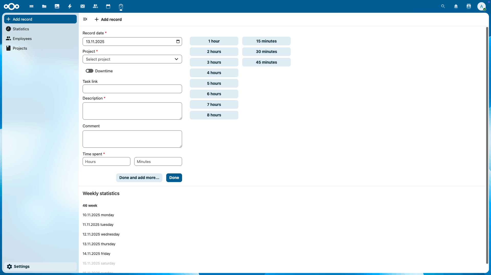
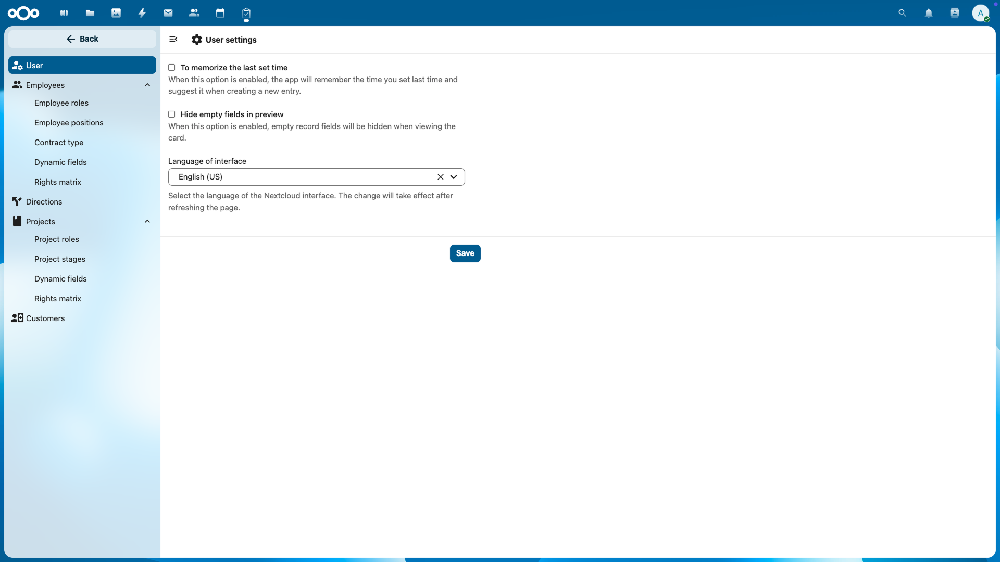
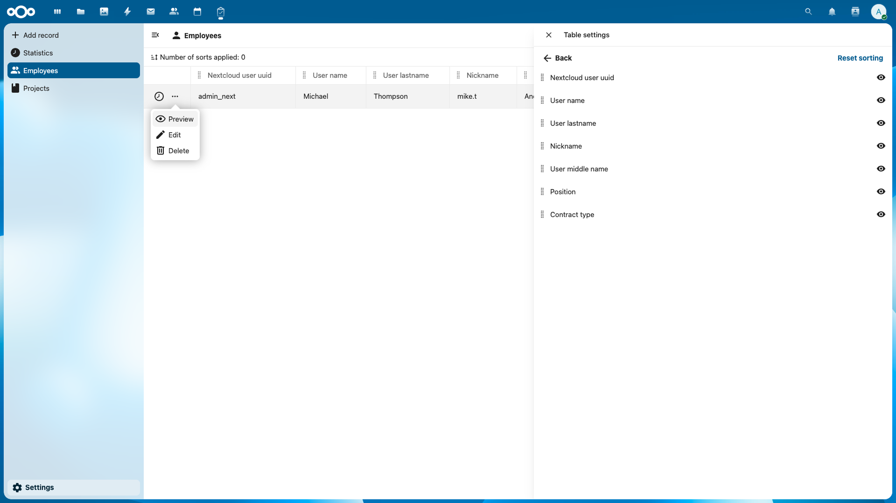
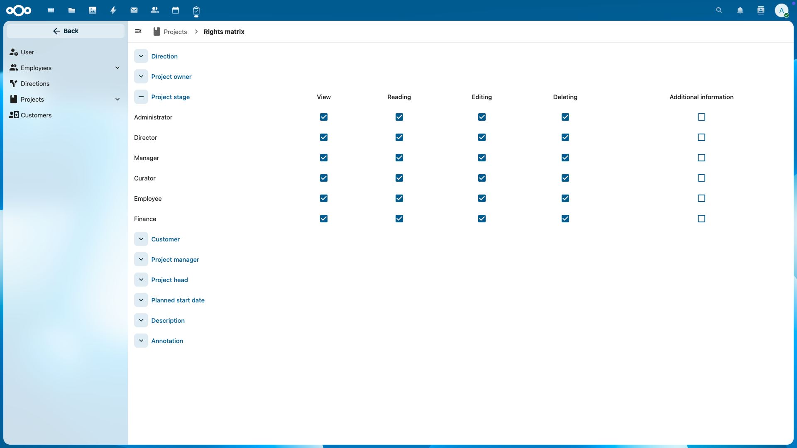
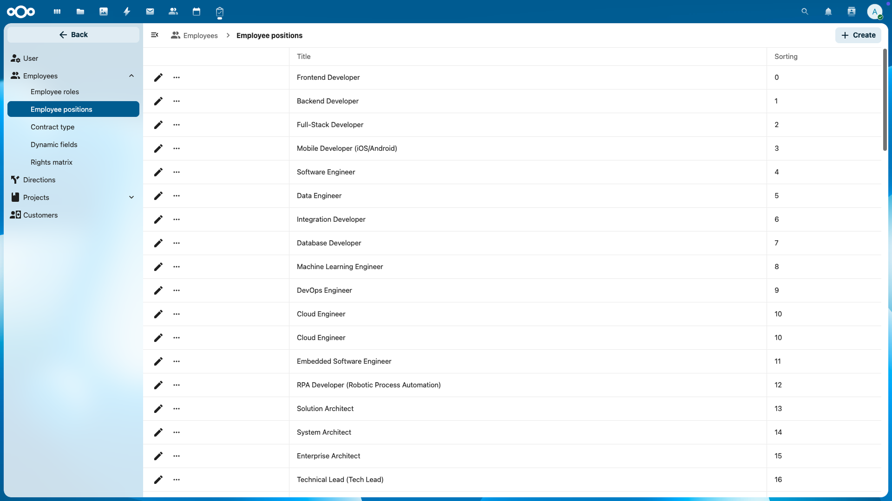
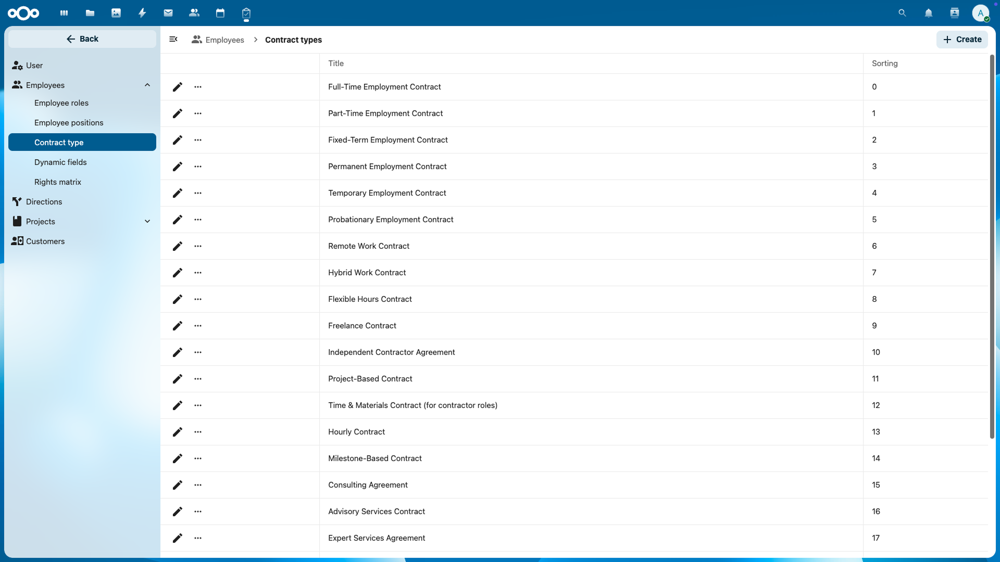
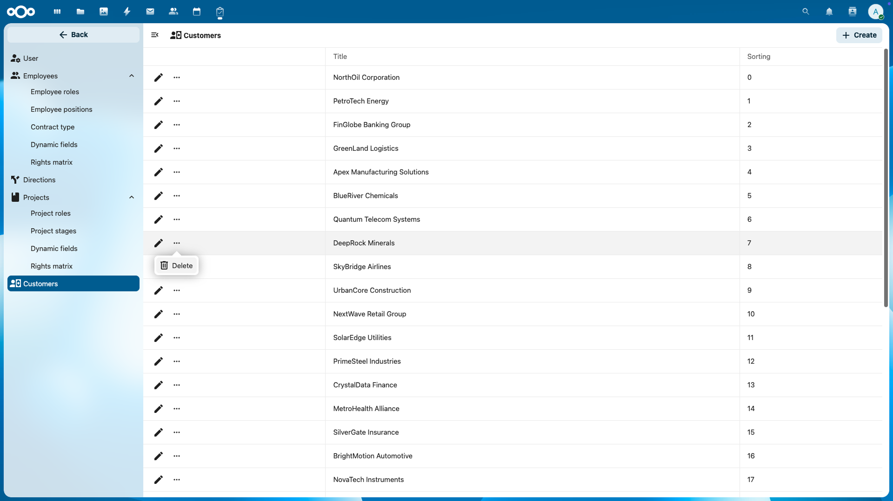
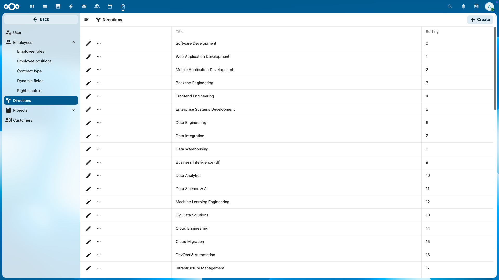
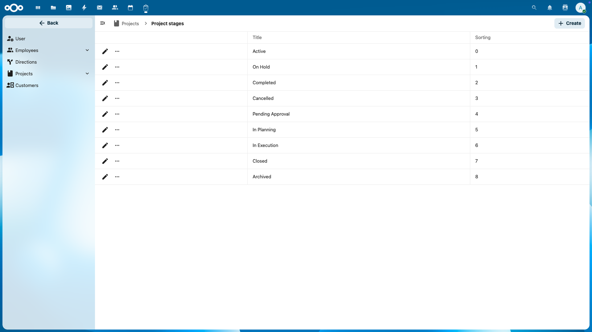
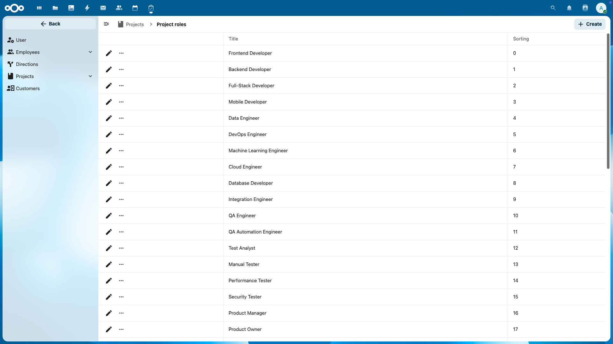

# ✅ Done — Smart Team & Project Management for Nextcloud

[](https://nextcloud.com)
[](https://opensource.org/license/mit)
[](https://github.com/the-done/done-nextcloud/releases)
[](https://github.com/the-done/done-nextcloud/issues)


## 📸 Screenshots

<details open>
<summary>🖼️ Add Record</summary>



</details>

<details>
<summary>🖼️ User Settings</summary>



</details>

<details>
<summary>🖼️ Employees</summary>



</details>

<details>
<summary>🖼️ Rights Matrix</summary>



</details>

<details>
<summary>🖼️ Employees Positions</summary>



</details>

<details>
<summary>🖼️ Employees Contract Types</summary>



</details>

<details>
<summary>🖼️ Customers</summary>



</details>

<details>
<summary>🖼️ Directions</summary>



</details>

<details>
<summary>🖼️ Project Stages</summary>



</details>

<details>
<summary>🖼️ Project Roles</summary>



</details>

---

Done is a Nextcloud app for managing employees, projects, and time reports in distributed teams.  
It provides flexible data structures, powerful analytics, and a fully customizable interface — built to make team utilization and workload tracking effortless.

---

## 🌟 Key Features

### 👥 Employees
- Create employee profiles from Nextcloud accounts (not every system account must be an employee)
- Add **custom fields** to store detailed information
- Browse in a **smart table**:
    - Drag & drop column order
    - Multi-level sorting and filtering
    - Show or hide any columns

### 📁 Projects
- Create projects and assign employees with **specific roles**
- Add **custom fields** for detailed project cards
- Smart, interactive project table with flexible display options

### 🕒 Time Reports
- Employees submit work time logs linked to projects
- Include task links, comments, and time spent (manual or quick-select)
- Automatic **statistics by project, employee, or team**

### 👩‍💻 Teams
- Combine employees into teams for workload overview
- Analyze utilization across multiple projects or independently

### 🧭 Directions
- Define analytical **Directions** for grouping projects, teams, and employees
- Use as an additional dimension for reports and analysis

### ⚙️ Customization & Access Control
- Add **custom fields** for *Employee* and *Project* entities
- Manage a **flexible permission matrix** for user roles
- Configure UI behavior (hide empty fields, adjust visibility)
- Built-in directories for Project and Team role types

---

## 🎯 Purpose

**Done** helps organizations efficiently track and manage employee workload and time allocation across projects.  
It is especially valuable for **remote and distributed teams**, giving visibility into productivity and utilization.

---

## 🚀 Roadmap

Upcoming features include:
- 💰 **Finance module** for automated managerial reporting
- 📊 **Reports module** with dashboards and analytics
- 🔗 Integration with Nextcloud apps: *Calendar, Deck, Tasks, Mail, Files*
- 🌐 External integrations with task management systems (per-project sync)

---


## 🛠️ Installation

### From Nextcloud App Store
The easiest way to install **Done** is directly from the Nextcloud App Store:
1. Navigate to your Nextcloud instance.
2. Go to `Apps` (or `Applications`).
3. Search for "Done".
4. Click `Enable`.

You can also find **Done** published on the official Nextcloud App Store [here](https://apps.nextcloud.com/apps/done).

### Manual Installation
1. Clone the repository:
   ```bash
   git clone https://github.com/the-done/nextcloud-done.git
   ```
2. Move it into your Nextcloud `apps` directory:
   ```bash
   mv done /var/www/nextcloud/apps/
   ```
3. Enable the app:
   ```bash
   occ app:enable done
   ```

4. Build the app:
   ```bash
   make build
   ```

---

## ⚖️ License

This project is licensed under the **MIT** license — see the [LICENSE](./LICENSE) file for details.

---

## 👨‍💻 About

**Developer:** [The Done](https://github.com/the-done)  
**Mission:** Digitalizing enterprise workflows to increase efficiency and quality.  
**Contact:** hello@the-done.app

---

> **Done** — make your project management truly *done* ✅
